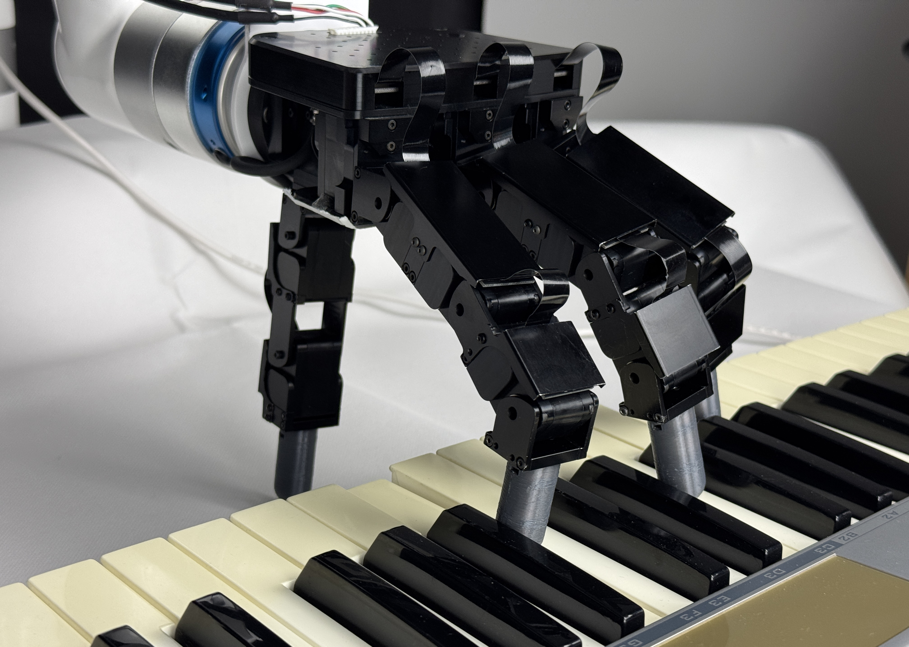

# Learning to Play Piano in the Real World



This project is based on the [Robopianist](https://github.com/google-research/robopianist) environment.
But while the Robopianist environment focuses entirely on simulation, this project aims at the transfer to the real
world.

### TLDR

Proof of concept for playing piano with a human-like hand in the real world using sim2real with domain randomization.
You can find more details on https://lasr.org/research/learning-to-play-piano.

### Abstract

Towards the grand challenge of achieving human-level manipulation in robots, playing piano is a compelling testbed that requires strategic, precise, and flowing movements. Over the years, several works demonstrated hand-designed controllers on real world piano playing, while other works evaluated robot learning approaches on simulated piano scenarios. In this paper, we develop the first piano playing robotic system that makes use of learning approaches while also being deployed on a real world dexterous robot. Specifically, we make use of Sim2Real to train a policy in simulation using reinforcement learning before deploying the learned policy on a real world dexterous robot. In our experiments, we thoroughly evaluate the interplay between domain randomization and the accuracy of the dynamics model used in simulation. Moreover, we evaluate the robot's performance across multiple songs with varying complexity to study the generalization of our learned policy. By providing a proof-of-concept of learning to play piano in the real world, we want to encourage the community to adopt piano playing as a compelling benchmark towards human-level manipulation. We open-source our code and show additional videos at https://lasr.org/research/learning-to-play-piano.  

## Installation Instructions

### Setup to Train a Policy

Note: Make sure you are using the same conda environment you created for RoboPianist (
see [here](https://github.com/google-research/robopianist/blob/main/README.md#installation)).

1. Install [JAX](https://github.com/google/jax#installation)
2. Run `pip install -r requirements.txt`

The file `train.py` is used to train the models.

### Setup for the Real World Execution

```bash
# create env with python 3.9
# 3.9 is required by ros-sensor-msgs
conda create -n <env_name> python=3.9
conda activate <env_name>

# For rospy installation
export PIP_EXTRA_INDEX_URL="https://rospypi.github.io/simple/"
# For jax with cuda support
export PIP_FIND_LINKS="https://storage.googleapis.com/jax-releases/jax_cuda_releases.html"

# The rospy dependencies need to be installed first
pip install rospy 
# Now the other stuff
conda env update -n <env_name> --file environment.yml

# Fix shared libs
cd $CONDA_PREFIX/lib
mkdir libstdc
mv libstdc* libstdc
open .
# Now paste the in the repo provided libstdc++ libs
```

The entry point of real world experiments is at `robopianist/execution/real_world_execution.py`.

## License

In our work we use many different libraries and frameworks. The licenses of these libraries can be found in
the `licenses` folder.
Our work is licensed under the MIT License. For more details see the `LICENSE` file at the root of the repository.